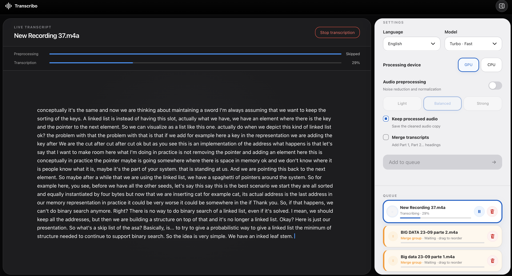
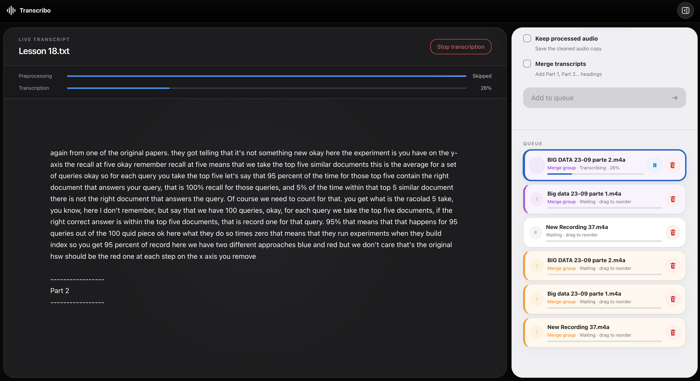

# 📚 Transcribo

A powerful, standalone web application designed to turn **hours of lecture recordings** into clean, readable text using hardware acceleration.

> 😁 So you don’t have to re-listen to the same lecture at 1.5x speed ever again.


<p align="center">
  <!-- 🖼️ PLACEHOLDER: Insert a wide screenshot of the main application interface here -->
  
</p>

---

## ✨ Features

- **Blazing Fast**: Hardware-accelerated transcription using advanced AI frameworks.
- **Smart Audio Preprocessing**: Built-in FFmpeg filters to clean up noisy classroom recordings, fix clipping, and enhance voice clarity.
- **Parallel Preprocessing**: Choose 1–4 FFmpeg workers to prepare multiple queued recordings at the same time while keeping MLX transcription ordered and single-threaded.
- **Drag & Drop Queue**: Queue multiple recordings, reorder them on the fly, and pause/resume transcriptions anytime.
- **Merge Transcripts**: Seamlessly group multiple audio parts together and export them into a single, structured text file.
- **Privacy First**: Everything runs 100% locally on your machine. No internet connection required, no data sent to the cloud.

---

## ⚙️ Requirements

1. **Python 3.9+** installed on your system.
2. **FFmpeg** installed (required for audio preprocessing). If you don't have it, install it via your system's package manager:
   - **Linux/Ubuntu**: `sudo apt install ffmpeg`
   - **Homebrew**: `brew install ffmpeg`
   - **Windows**: Download from the official site or use `winget install ffmpeg`

---

## 🚀 Installation & Getting Started

Setting up Transcribo is fully automated. You don't need to manually configure environments.

1. **Open your Terminal** and navigate to the Transcribo folder.
2. **Start the application** by running:
   ```bash
   ./start_app.sh
   ```
   *Note: The first time you run this command, it will automatically create an isolated virtual environment and install all necessary dependencies.*
3. **Open your browser** and go to [http://localhost:7860](http://localhost:7860).

*(Keep the terminal window open while using the app. Press `Ctrl+C` in the terminal to close Transcribo).*

---

## 🎛️ How to Use the App

1. **Add Files**: Drag and drop your audio files (`.m4a`, `.mp3`, `.wav`, `.mp4`, etc.) into the sidebar on the right.
2. **Choose Settings**:
   - **Model**: `Turbo` (Faster) or `Large` (More accurate). *Note: The first time you use a new model, it may take a few minutes to download its weights.*
   - **Language**: Auto-detect or force a specific language (e.g., Italian).
   - **Preprocessing**: `Light`, `Balanced` (Recommended), or `Strong` depending on the background noise of the original recording.
   - **Preprocessing workers**: Choose how many recordings FFmpeg may preprocess simultaneously. Start with `2`; higher values use more CPU and disk bandwidth.
   - **Merge Transcripts**: If your lecture is split across multiple files, check this box. They will be processed as a group and exported as a single merged document.
3. **Manage the Queue**: 
   - Click **"Add to queue"** to send them to the processing queue.
   - You can drag files up and down in the queue to change their priority. 
   - If you grouped files to merge, dragging them outside the group will move the entire block together! You can also drag files *inside* the block to fix the order (e.g., swap Part 1 and Part 2).
4. **Download**: Once finished, you can read the live text directly in the browser and download the `.txt` file using the download button.


<p align="center">
  <!-- 🖼️ PLACEHOLDER: Insert a screenshot showing the final transcribed text and the download button -->
  
</p>

---

## 📁 Where are my files?

All your outputs are neatly organized inside the `data/` folder (created automatically on first run):
- `data/transcriptions/`: Contains your final `.txt` transcripts.
- `data/processed_audio/`: Contains the cleaned, enhanced audio copies (if you enabled "Keep processed audio").
- `data/uploads/`: Temporary folder for queued files.
